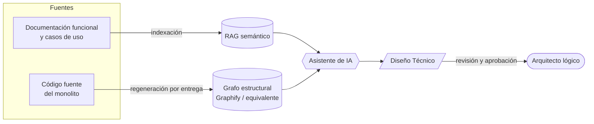
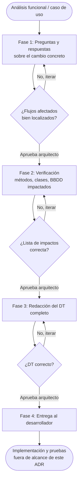

# ADR-001: Adoptar un asistente de IA para apoyar la elaboración de diseños técnicos

| Campo | Valor |
|-------|-------|
| **Estado** | Propuesto |
| **Fecha** | 2026-08-30 |
| **Decisor** | Arquitecto lógico (autor de este documento) |
| **Ámbito** | Proceso de paso de análisis funcional / caso de uso → diseño técnico (DT). La implementación posterior del DT por parte de los desarrolladores queda **fuera de alcance** de este documento, al estar ya cubierta por el uso actual de IA (Copilot) en esa fase. |

---

## Contexto

Actualmente, pasar de un caso de uso o análisis funcional (según el proyecto) a diseño técnico depende exclusivamente del equipo de arquitectos lógicos, lo que genera un cuello de botella cuando se empieza un proyecto nuevo: no hay diseños técnicos hechos y el desarrollo tiene que arrancar igualmente. Otro inconveniente habitual es que los casos de uso no encajan con el código ya implementado, lo que obliga a retrabajo junto con el equipo funcional.

El sistema es un monolito con unos 20 años de evolución, sin una estructura homogénea al 100 % entre componentes: algunos concentran BBDD + lógica de negocio + API + pantalla, otros solo una parte. Existe una estructura general, pero con excepciones — no hay una única "ley" de cómo se implementa algo.

> [!NOTE]
> Esta decisión se plantea por **motivación propia de mejora personal**, con el objetivo de adaptar el flujo de trabajo del proyecto a la tendencia actual de IA. No responde a una exigencia del proyecto ni del cliente.

---

## Decisión

> [!IMPORTANT]
> Adoptamos un **asistente de IA para apoyar la elaboración de diseños técnicos**, basados en lo definido en los análisis funcionales y los casos de uso posteriores. Estos DT se seguirán entregando a los desarrolladores para su implementación y pruebas; esa parte del proceso queda fuera de este documento, ya que actualmente se apoya en IA por otra vía.

### Fuentes de contexto para la IA

Dos mecanismos distintos, para dos tipos de fuente distinta:

| # | Mecanismo | Fuente | Actualización |
|---|-----------|--------|---------------|
| 1 | **RAG semántico** | Toda la documentación funcional y casos de uso ya existentes del proyecto | Con cada nuevo documento funcional |
| 2 | **Grafo estructural del código fuente** | Código fuente, con herramientas del tipo Graphify u otras equivalentes (a evaluar cuál encaja mejor en cada proyecto) | Regenerar cada vez que se modifique el código — p. ej. con cada entrega de requisito — para mantener el contexto lo más actualizado posible |

### Flujo de trabajo por fases

La IA ejecuta cada fase completa, pero **no avanza a la siguiente sin aprobación explícita del arquitecto lógico**. Cada fase puede requerir las iteraciones necesarias antes de aprobarse y pasar a la siguiente.

| Fase | Qué hace la IA | Checkpoint humano | Salida |
|------|----------------|-------------------|--------|
| 1. Preguntas y respuestas | Con los documentos cargados en el RAG y el grafo del código generado, responde sobre el cambio concreto hasta dejar claro en qué puntos del código están implementados los flujos afectados | El arquitecto valida que los flujos afectados están bien localizados | Mapa de puntos de código impactados por el cambio |
| 2. Verificación | Ayuda a decidir qué métodos, clases, estructura de base de datos, etc. deben verse impactados en el DT | El arquitecto fija y aprueba la lista de impactos | Lista de impactos confirmada |
| 3. Redacción del DT | Redacta el **DT completo** a partir de los impactos ya definidos | El arquitecto lógico verifica el DT | DT redactado |
| 4. Entrega | — | — (fuera de alcance de este ADR) | DT aprobado entregado al desarrollador para su implementación |

> [!IMPORTANT]
> El **arquitecto lógico sigue siendo en todo momento el responsable del DT**: la IA acelera el proceso, no sustituye esa responsabilidad.

---

## Alternativas consideradas

| # | Alternativa | Motivo de descarte | ¿Revisable? |
|---|-------------|--------------------|-------------|
| 1 | **No usar IA, mantener el proceso 100 % manual actual** | En muchas ocasiones el equipo de arquitectura lógica es el cuello de botella que frena el avance del proyecto | — |
| 2 | **Usar un chat genérico de IA sin RAG ni grafo de código**, pegando el documento funcional a mano cada vez | Ya es lo que se hace hoy de forma puntual: consume tokens y las respuestas no son suficientemente acertadas, al no tener contexto completo del código ni de la documentación indexada | — |
| 3 | **Ir directo del análisis funcional al DT**, sin las fases intermedias de preguntas/respuestas y verificación | El proyecto es tan grande y ha sido implementado por tanta gente a lo largo de tantos años que no existe una estructura clara al 100 %. Está razonablemente organizado, pero con excepciones, y se está trabajando activamente en mejorarlo — saltarse la verificación aumentaría el riesgo de un DT mal encajado con el código real | — |
| 4 | **Adoptar una herramienta comercial ya empaquetada** ("AI architecture assistant" de mercado) en vez de montar un pipeline propio con RAG + grafo estructural | El conocimiento tácito del proyecto (estructura heterogénea, excepciones, 20 años de evolución) es tan específico que una herramienta genérica necesitaría igualmente una fase de indexación/adaptación a medida. El ahorro frente al pipeline propio no está claro con la información actual | Sí — se revalorará si el pipeline propio no llega a escalar |

---

## Consecuencias

### Positivas

- El equipo de arquitectura lógica deja de ser un cuello de botella para el avance del proyecto.
- Los DT resultantes son más acertados, al apoyarse en un análisis previo (preguntas/respuestas + verificación) sobre el código real, no solo sobre el análisis funcional.
- Todos los DT comparten la misma estructura y formato (definidos como plantilla/prompt de contexto para la IA), incorporando buenas prácticas de desarrollo y las especificaciones dadas.
- Facilita el onboarding de nuevos arquitectos lógicos: actualmente hay pocas personas capacitadas para este rol en el proyecto; un documento/prompt de contexto permitiría que la IA ayude a una persona nueva a orientarse más rápido en un sistema de 20 años de evolución.

### Negativas / riesgos

- Si la IA se equivoca en alguna fase y el error no se detecta en el checkpoint correspondiente, el fallo se arrastra hasta el DT y, de ahí, a la implementación. Este riesgo existe hoy igualmente cuando el error lo comete el arquitecto lógico directamente, por lo que no es un riesgo nuevo, pero sí debe vigilarse con la misma exigencia de revisión.
- Coste de mantenimiento continuo: hay que mantener actualizados tanto el RAG (con cada nuevo documento funcional) como el grafo estructural del código (regenerándolo, por ejemplo, con cada entrega de requisito).

### Condición de reversibilidad

Si llegado el caso este enfoque ralentiza el trabajo o empeora los resultados en vez de ayudar, siempre se puede volver al flujo de trabajo manual actual. Antes de abandonar el enfoque, se realizará un estudio de qué ha fallado concretamente (fase del pipeline, calidad del contexto, herramienta de grafo, etc.) para intentar corregirlo y evolucionar el flujo de trabajo, en vez de descartarlo directamente.
